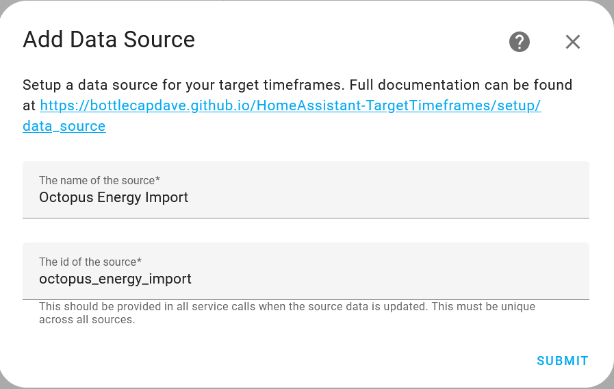

# Getting started

## Installing the integration

The first thing you need to do is install the new integration. Full instructions can be found on the [home page](../index.md#how-to-install).

## Setting up data sources

Once installed, you'll need to setup a data source that represents data coming from this integration. This can be done by [following the link](https://my.home-assistant.io/redirect/config_flow_start/?domain=target_timeframes) or searching for the integration in your integrations view. You'll need a data source for each unique set of data that your target timeframes will be based upon. This could be something like your electricity rates from an integration like [Octopus Energy](https://bottlecapdave.github.io/HomeAssistant-OctopusEnergy/) or carbon intensity from an integration like [Carbon Intensity](https://bottlecapdave.github.io/HomeAssistant-CarbonIntensity/).

Full details of everything that can be configured can be found in the [Data Source](./data_source.md). An example for Octopus Energy, the name would be something like `Octopus Energy Import` with a source id of `octopus_energy_import`, but you can pick whatever you want as long as it's unique within the integration.

## Configuring data source data

Once you've configured a data source, you'll need to get data assigned to the data source so any associated target timeframes can be based upon that data. The data is added via an available [service](../services.md#target_timeframesupdate_target_timeframe_data_source). To make things easier, there are also a [range of blueprints](../blueprints.md#data-sources) you can install which add data from external integrations into a Target Timeframe given data source.

## Setting up Target Timeframe sensors

Now we have our data source representing our data and data syncing from an external source into Target Timeframes, it's time to now add a target timeframe sensor. Each type of sensor are added as a sub entry to our data source. You can see below what the menu looks like.

For more detail on what each of these sensors provide, you should consult the detailed page on [target timeframe](./target_timeframe.md) and [rolling target timeframe](./rolling_target_timeframe.md).